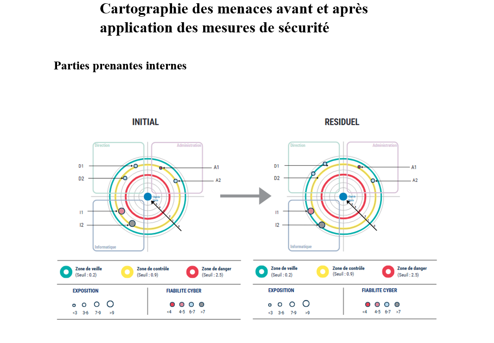

# Cybersecurity Risk Assessment: E‑Learning Ecosystem (EBIOS RM)

  
*Extract from the EBIOS RM workshop – threat mapping for internal stakeholders.*

## Overview

This project applies the **EBIOS Risk Manager (EBIOS RM)** methodology to perform a strategic cybersecurity risk assessment for an online training platform. The analysis covers the entire digital ecosystem, identifies critical stakeholders, constructs realistic attack scenarios, and proposes tailored security measures to reduce residual risk. The project demonstrates advanced risk management skills and the ability to translate business context into actionable security recommendations.

## Objectives

- Apply the **EBIOS RM** framework to model and evaluate cybersecurity risks.
- Identify internal and external stakeholders critical to the ecosystem.
- Develop a **digital threat map** covering both technical and organisational dimensions.
- Build **strategic attack scenarios** (DDoS, software vulnerabilities) and assess their impact.
- Propose concrete security measures and evaluate residual risk.
- Produce a structured, professional risk analysis deliverable.

## Methodology: EBIOS Risk Manager

EBIOS RM is the French national reference method for risk management, fully aligned with ISO/IEC 27005. The project followed its five workshops:

| Workshop                          | Activities Performed                                                                 |
|-----------------------------------|--------------------------------------------------------------------------------------|
| **1. Framing & Security Baseline**| Defined scope, identified critical assets (LMS, databases, administrative data).    |
| **2. Dreaded Events**             | Determined major business impacts (unavailability, data breach, reputational damage).|
| **3. Strategic Scenarios**        | Built two attack paths: **DDoS** and **exploitation of software vulnerabilities**.  |
| **4. Operational Scenarios**      | Detailed attack chains, threat sources, and opportunity paths.                       |
| **5. Risk Treatment**             | Defined countermeasures per stakeholder, evaluated residual risk.                    |

## Technologies & Tools

| Tool / Concept               | Usage                                                   |
|------------------------------|---------------------------------------------------------|
| **EBIOS RM**                 | Core risk management methodology                        |
| **Stakeholder Matrices**     | Mapping of internal/external actors and their roles     |
| **Threat Modeling**          | Construction of attack trees and opportunity paths      |
| **Risk Matrices**            | Qualitative evaluation (likelihood × impact)            |
| **Mitigation Planning**      | Action plans per stakeholder category                   |

## Environment & Scope

- **Organisation**: Online training company (e‑learning platform)
- **Internal stakeholders**: Founders, HR, developers, security experts
- **External stakeholders**: End‑users, regulators, commercial partners, cybersecurity consultants
- **Assets**: LMS platform, application servers, databases, personal and pedagogical data

## Key Findings

### Scenario 1: Distributed Denial of Service (DDoS)

| Attribute          | Detail                                                                 |
|--------------------|------------------------------------------------------------------------|
| **Risk Source**    | DDoS attacks                                                           |
| **Targeted Objectives** | Service interruption, platform unavailability                    |
| **Attack Path**    | 1. Attacker identifies platform servers → 2. Launches massive DDoS → 3. Servers overloaded → 4. Users cannot access courses |
| **Initial Threat** | 4/4 (Critical)                                                         |
| **Residual Threat**| 2/4 (after mitigation)                                                 |

### Scenario 2: Software Vulnerabilities in the Platform

| Attribute          | Detail                                                                 |
|--------------------|------------------------------------------------------------------------|
| **Risk Source**    | Known or zero‑day vulnerabilities in the LMS or underlying components |
| **Targeted Objectives** | Service interruption, unauthorised access, data theft            |
| **Attack Path**    | 1. Attacker identifies a vulnerability → 2. Exploits it to gain access → 3. Disrupts services or steals data |
| **Initial Threat** | 3/4 (High)                                                             |
| **Residual Threat**| 1/4 (after mitigation)                                                 |

## Security Measures & Residual Risk

The following table summarises the measures defined for each critical stakeholder group and the resulting residual risk reduction.

| Stakeholder                  | Attack Path         | Security Measures                                                                 | Initial Threat | Residual Threat |
|------------------------------|---------------------|-----------------------------------------------------------------------------------|----------------|-----------------|
| **Direction / Founders**     | DDoS                | Use DDoS mitigation service; establish incident response plan                     | 4              | 2               |
|                              | Vulnerabilities     | Regular patching; security testing                                                | 3              | 1               |
| **Dev Team / IT**            | DDoS                | Redundancy strategies; load balancing                                             | 4              | 2               |
|                              | Vulnerabilities     | Regular security audits; secure coding training                                   | 3              | 1               |
| **Security Experts**         | DDoS                | Anomaly detection systems                                                         | 4              | 2               |
|                              | Vulnerabilities     | Continuous security training; code reviews                                        | 3              | 1               |
| **End‑users**                | DDoS                | Proactive communication; offline alternatives                                     | 4              | 2               |
|                              | Vulnerabilities     | Data protection measures (encryption, access control)                             | 3              | 1               |
| **Regulatory Authorities**   | DDoS                | Mandate minimum security requirements for providers                               | 4              | 2               |
|                              | Vulnerabilities     | Require regular security audits and compliance reports                            | 3              | 1               |
| **Cybersecurity Consultants**| DDoS                | Deploy monitoring and threat detection tools                                      | 4              | 2               |
|                              | Vulnerabilities     | Provide specific security recommendations; conduct periodic audits                | 3              | 1               |

## Results & Impact

- **Two high‑priority attack scenarios** were fully modelled with detailed attack paths.
- **Threat maps** were produced for both internal and external stakeholders, visualising the criticality of each actor.
- **Security measures** were tailored to each stakeholder group, reducing the threat level from **critical (4)** to **moderate (2)** for DDoS, and from **high (3)** to **low (1)** for software vulnerabilities.
- The analysis provides a **foundation for a formal risk treatment plan** and supports compliance with regulatory expectations.

## Lessons Learned

- **EBIOS RM is highly structured** – The five‑workshop approach ensures no aspect of risk is overlooked.
- **Stakeholder involvement is crucial** – Mapping both internal and external actors reveals hidden dependencies and attack surfaces.
- **Attack scenarios must be realistic** – Concrete paths (like DDoS or vulnerability exploitation) resonate better with decision‑makers.
- **Residual risk evaluation** forces prioritisation and demonstrates the value of security investments.
- **Communication of results** – Visual tools (matrices, graphs) are essential for explaining complex risks to non‑technical stakeholders.

## Future Improvements

- Extend the analysis to **operational scenarios** (technical attack trees) for deeper validation.
- Integrate **quantitative risk metrics** (e.g., using FAIR) where data allows.
- Develop a **dashboard** to track risk evolution over time.
- Perform a **technical audit** to confirm the existence of the assumed vulnerabilities.
- Run a **table‑top exercise** with stakeholders to test the incident response plan derived from the analysis.

---

Author: Esso Maléki TONINZIBA
